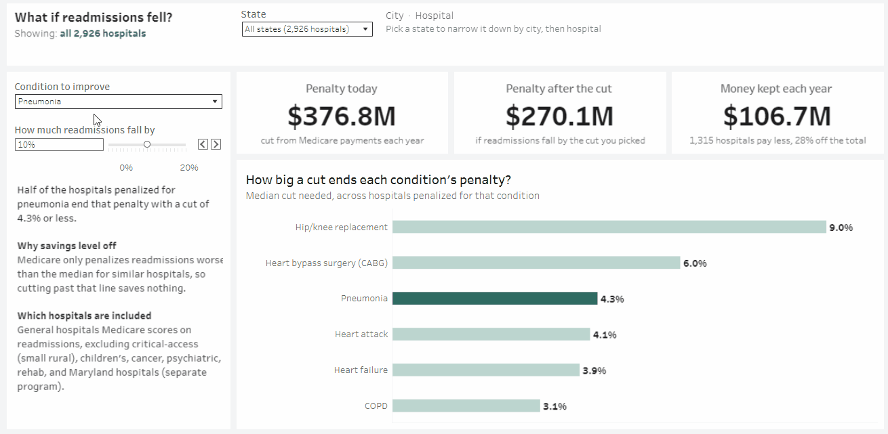
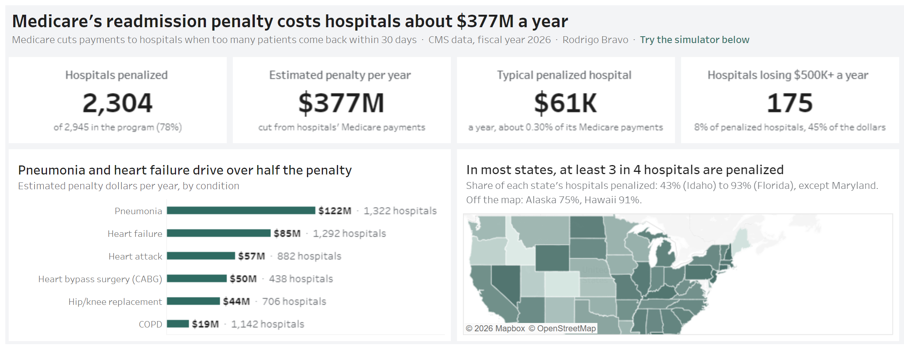
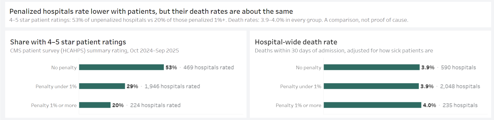

# Medicare Hospital Readmission Penalty Analysis

Medicare fines hospitals when too many patients come back within 30 days. This project shows which conditions cause those fines, where they hit hardest, and how much a hospital would save by bringing readmissions down.

**[Open the interactive dashboard](https://public.tableau.com/app/profile/bravorod/viz/MedicareReadmissionPenaltySimulator/Readmissionpenalty)**

[](https://public.tableau.com/app/profile/bravorod/viz/MedicareReadmissionPenaltySimulator/Readmissionpenalty)

Pick a condition and how much readmissions drop, then narrow it down to a state, city, or single hospital. The dashboard shows the fine today, the fine after the improvement, and the money the hospital keeps.

## The question

Every year, Medicare checks how often patients return to each hospital after treatment for six conditions, like pneumonia and heart failure. Hospitals that do worse than similar hospitals lose up to 3% of their Medicare payments. Hospital leaders need to know three things: how much this costs them, which condition is driving it, and what fixing it would be worth.

## What I found

[](https://public.tableau.com/app/profile/bravorod/viz/MedicareReadmissionPenaltySimulator/Readmissionpenalty)

- **The fines add up to about $377M a year.** 78% of hospitals in the program (2,304 of 2,945) are penalized in fiscal year 2026.
- **Two conditions cause most of it.** Pneumonia ($122M) and heart failure ($85M) make up over half of all penalty dollars.
- **A small group carries much of the cost.** 175 hospitals lose $500K or more a year. They're 8% of penalized hospitals but pay 45% of the total.
- **One focused fix saves real money.** If hospitals cut pneumonia readmissions by 10%, they'd keep about $107M a year, and 1,315 hospitals would pay less.
- **The fines track patient ratings, not deaths.** Hospitals with the biggest penalties were far less likely to earn 4–5 star patient ratings (20% vs 53%), but their death rates were about the same as everyone else's.



This compares hospitals side by side. It doesn't prove that one thing causes the other.

## What a hospital should do

1. **Start with the condition behind most of your penalty.** For most hospitals, one condition makes up the biggest share, so that's where improvement pays off first.
2. **Aim for the level of similar hospitals, not beyond it.** Medicare only fines readmissions above that level. Once a hospital reaches it, further improvement for that condition saves nothing on the penalty.

## How I know the numbers are right

Medicare publishes each hospital's final penalty but not the full math behind it. I rebuilt the formula from Medicare's raw data, then checked my result against Medicare's published number for every hospital. All 2,945 match, within the rounding Medicare uses. An automated test reruns this check every time the data is rebuilt, so a mistake would be caught right away.

## How I built it

1. **Collected the data:** six public files from the Centers for Medicare & Medicaid Services (CMS), loaded into Google BigQuery with Python.
2. **Cleaned and modeled it:** used SQL and dbt to clean each file and rebuild the penalty step by step.
3. **Tested it:** checked the rebuilt penalty against Medicare's published results for every hospital.
4. **Ran the "what if" numbers:** used Python to recalculate penalties with fewer readmissions for each condition.
5. **Built the dashboard:** turned the results into an interactive Tableau dashboard.

**Tools:** SQL, dbt, BigQuery, Python (pandas), Tableau

## Things to keep in mind

- **Dollar amounts are estimates.** They multiply each hospital's penalty rate by its 2024 Medicare payments, the most recent year available.
- **The simulator changes one hospital at a time.** In reality, if many hospitals improve, the bar they're measured against moves too.
- **This covers fiscal year 2026.** Medicare changed the rules for 2027, so the formula would need updating for next year.
- **Ratings and penalties may share a cause.** Hospitals that serve sicker or lower-income patients may score lower on both.

## Data sources

- [FY2026 Hospital Readmissions Reduction Program supplemental file](https://www.cms.gov/medicare/payment/prospective-payment-systems/acute-inpatient-pps/fy-2026-ipps-final-rule-home-page)
- [Hospital Readmissions Reduction Program](https://data.cms.gov/provider-data/dataset/9n3s-kdb3)
- [Medicare Inpatient Hospitals by Provider, 2024](https://data.cms.gov/provider-summary-by-type-of-service/medicare-inpatient-hospitals/medicare-inpatient-hospitals-by-provider)
- [Hospital General Information](https://data.cms.gov/provider-data/dataset/xubh-q36u)
- [Patient survey (HCAHPS)](https://data.cms.gov/provider-data/dataset/dgck-syfz)
- [Complications and Deaths](https://data.cms.gov/provider-data/dataset/ynj2-r877)

## Run it

```bash
pip install -r requirements.txt
export GCP_PROJECT=your-project-id   # Windows: set GCP_PROJECT=your-project-id
python load_raw.py
cd dbt && dbt build --profiles-dir . && cd ..
python export.py
python what_if.py
```
